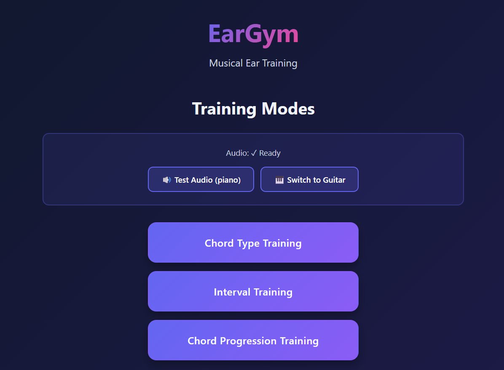
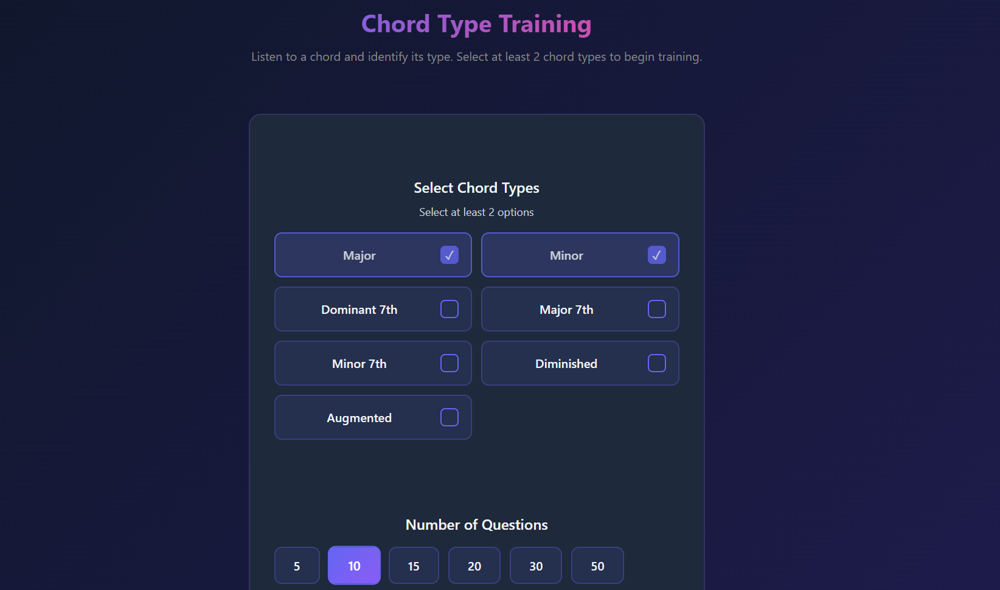
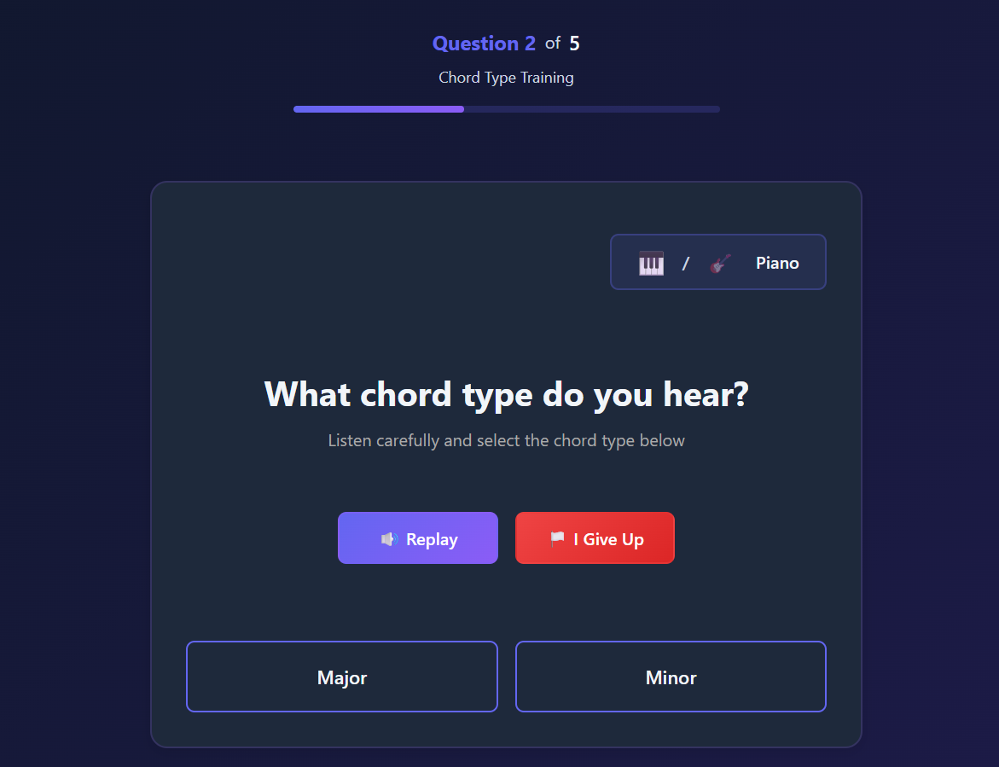
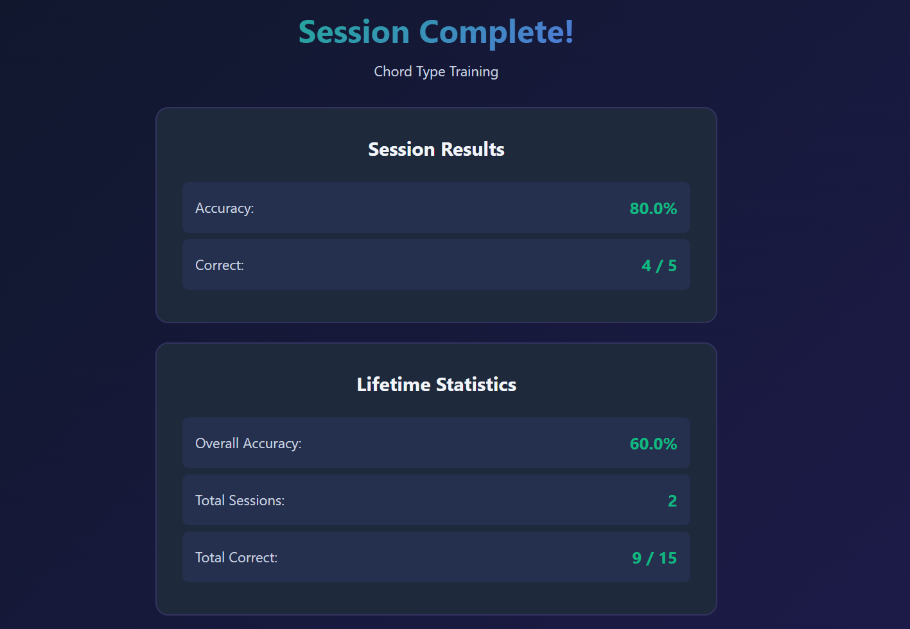

# EarGym

A web-based musical ear training application with multiple training modes to help you develop your musical hearing skills. Built with React, TypeScript, and Tone.js.

## Features

- **Three Training Modes:**
  - Chord Type Training - Identify chord types by ear
  - Interval Training - Recognize intervals between notes
  - Chord Progression Training - Identify chord progressions using Roman numeral notation

- **Customizable Training Sessions:**
  - Configure difficulty and options for each mode
  - Choose number of questions per session
  - Guest mode available (play without saving statistics in case you wanna test a mode or show someone the website)

- **Dual Instrument Support:**
  - Switch between Piano and Guitar sounds
  - Per-question instrument selection

- **Progress Tracking:**
  - Session statistics
  - Lifetime accuracy tracking per mode (stored in localStorage)

## Installation

### Prerequisites

- Node.js (version 14 or higher)
- npm or yarn

### Setup

1. Clone the repository:
```bash
git clone https://github.com/AlanElPlatano/EarGym.git
cd eargym
```

2. Install dependencies:
```bash
npm install
```

3. Start the development server:
```bash
npm run dev
```

4. Open your browser and navigate to `http://localhost:5173`

### Build for Production

To create a production build:
```bash
npm run build
```

To preview the production build:
```bash
npm run preview
```

### Deploy to GitHub Pages

To deploy the application to GitHub Pages:
```bash
npm run deploy
```

## Usage

### Main Menu

The main menu is your starting point, displaying all available training modes.



From here, you can:
- Select one of the three training modes (Chord Type, Interval, or Chord Progression)
- View your lifetime statistics by clicking the "Stats" button
- Choose which training mode to start

---

### Configuration Screen

Before starting a training session, you'll configure the mode settings and session options.



**Common Options (All Modes):**
- Number of questions (10, 20, 30, or 50)
- Guest mode toggle (play without saving to statistics)

**Mode-Specific Settings:**

#### Chord Type Training
- Select chord types to practice (Major, Minor, Dominant 7th, Major 7th, Minor 7th, etc.)
- Minimum 2 chord types required
- Octave range configuration

#### Interval Training
- Choose interval types (Minor 2nd through Octave)
- Set octave range for notes
- Select direction: Random, Ascending, or Descending
- Enable harmonic mode (both notes play simultaneously)
- Include compound intervals (beyond one octave)

#### Chord Progression Training
- Difficulty: Easy (2-4 chords) or Hard (5-8 chords)
- Chord pool: Diatonic only, Non-diatonic only, or Both
- Key selection: Random or specific key (C, D, E, F, G, A, B with major/minor)
- BPM is randomized within a reasonable range

---

### Training/Question Screen

This is where the actual training happens. You'll hear audio and answer questions based on what you hear.



**Universal Features:**
- **Question Counter:** Shows your progress (e.g., "Question 5/20")
- **Replay Button:** Hear the audio again as many times as needed
- **Instrument Selector:** Toggle between Piano and Guitar sound
- **Answer Options:** Varies by mode (buttons, dropdowns, or text input)
- **"I Give Up" Button:** Reveals the correct answer without affecting your statistics
- **Feedback Display:** Shows whether your answer was correct or incorrect

**Mode-Specific Answer Methods:**

- **Chord Type Training:** Click the chord type button you hear
- **Interval Training:** Click the interval button you hear
- **Chord Progression Training:** Select chords from dropdowns to build the progression (key is displayed before playing)

---

### Stats Screen

After completing a session, view your results and lifetime statistics.



**Session Stats:**
- Questions answered
- Correct answers
- Accuracy percentage for current session

**Lifetime Stats:**
- Total questions answered per mode
- Total correct answers per mode
- Overall accuracy rate per mode

Stats are persisted in your browser's localStorage and tracked separately for each training mode.

---

## Training Modes Details

### Chord Type Training
Learn to identify different chord qualities by ear. Available chord types include Major, Minor, Dominant 7th, Major 7th, Minor 7th, and various 9th chords.

### Interval Training
Develop your ability to recognize the distance between two notes. Practice with all common intervals from Minor 2nd to Octave, with options for ascending, descending, or random direction. Harmonic mode allows you to hear both notes simultaneously.

### Chord Progression Training
Train your ear to recognize common chord progressions in various keys. The application provides the key before playing, and you identify the progression using Roman numeral notation. Choose between diatonic chords (I, ii, iii, IV, V, vi, vii°) and non-diatonic options.

## Technologies Used

- **React** - UI framework
- **TypeScript** - Type-safe JavaScript
- **Tone.js** - Web Audio framework for sound generation
- **Vite** - Build tool and development server
- **GitHub Pages** - Deployment platform

## Browser Compatibility

EarGym works best on modern browsers with Web Audio API support like:
- Chrome/Edge (recommended)
- Firefox
- Safari

I only tested it on Chrome myself but you will be the judge for the other browsers, theoretically it should work.
